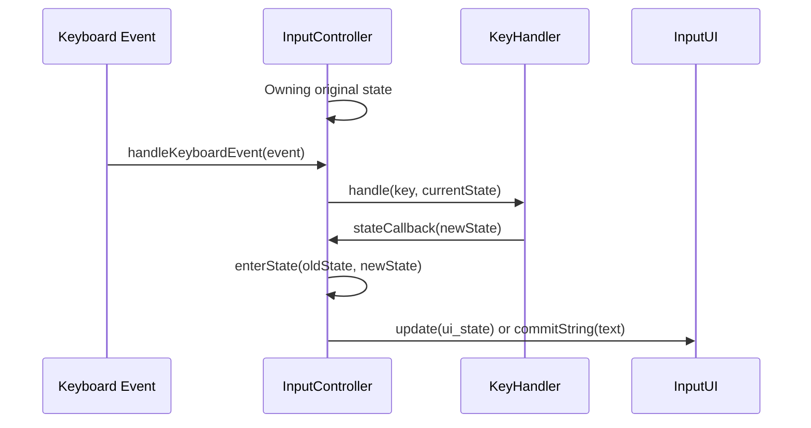

# McTabimWeb Components

This document describes the high-level architecture of the McTabimWeb input
method engine.

## Component Interaction Diagram

The following diagram illustrates the interaction between the core components of
the input method engine.

## Component Descriptions

- **`InputController`**: The central orchestrator of the input method engine. It
  receives keyboard events, manages the current state, and interacts with the
  UI.
- **`KeyHandler`**: A stateless component responsible for processing key events
  based on the current state. It determines the next state of the input method.
- **`InputState`**: Represents the current state of the input method, such as
  whether it's empty, inputting characters, or committing a string.
- **`InputUI`**: An interface that defines how the input method engine
  communicates with the user interface. This allows the engine to be decoupled
  from the specific UI implementation.
