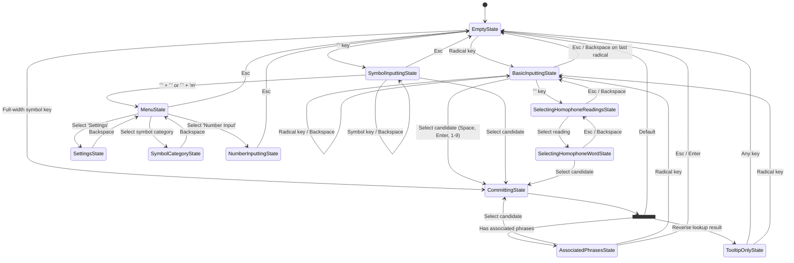

# Input States

This diagram illustrates the various input states within McTabimWeb and the
transitions between them based on user input.

```mermaid
stateDiagram-v2
    [*] --> EmptyState

    state fork_state <<fork>>
    EmptyState --> BasicInputtingState: Radical key
    EmptyState --> SymbolInputtingState: '`' key
    EmptyState --> CommittingState: Full-width symbol key

    BasicInputtingState --> BasicInputtingState: Radical key / Backspace
    BasicInputtingState --> CommittingState: Select candidate (Space, Enter, 1-9)
    BasicInputtingState --> EmptyState: Esc / Backspace on last radical
    BasicInputtingState --> SelectingHomophoneReadingsState: '`' key

    SymbolInputtingState --> SymbolInputtingState: Symbol key / Backspace
    SymbolInputtingState --> CommittingState: Select candidate
    SymbolInputtingState --> MenuState: '`' + '`' or '`' + 'm'
    SymbolInputtingState --> EmptyState: Esc

    SelectingHomophoneReadingsState --> SelectingHomophoneWordState: Select reading
    SelectingHomophoneReadingsState --> BasicInputtingState: Esc / Backspace

    SelectingHomophoneWordState --> CommittingState: Select candidate
    SelectingHomophoneWordState --> SelectingHomophoneReadingsState: Esc / Backspace

    MenuState --> SettingsState: Select 'Settings'
    MenuState --> SymbolCategoryState: Select symbol category
    MenuState --> NumberInputtingState: Select 'Number Input'
    MenuState --> EmptyState: Esc

    SettingsState --> MenuState: Backspace
    SymbolCategoryState --> MenuState: Backspace
    NumberInputtingState --> EmptyState: Esc

    CommittingState --> fork_state

    fork_state --> AssociatedPhrasesState: Has associated phrases
    fork_state --> TooltipOnlyState: Reverse lookup result
    fork_state --> EmptyState: Default

    AssociatedPhrasesState --> CommittingState: Select candidate
    AssociatedPhrasesState --> BasicInputtingState: Radical key
    AssociatedPhrasesState --> EmptyState: Esc / Enter

    TooltipOnlyState --> EmptyState: Any key
    TooltipOnlyState --> BasicInputtingState: Radical key
```
