# Input States

This diagram illustrates the various input states within McTabimWeb and the
transitions between them based on user input.

```mermaid
stateDiagram-v2
    [*] --> EmptyState

    state fork_state <<fork>>
    EmptyState --> BasicInputtingState: Radical key
    EmptyState --> SymbolInputtingState: '`' key
    EmptyState --> CommittingState: Full-width symbol key

    BasicInputtingState --> BasicInputtingState: Radical key / Backspace (Regular tables)
    BasicInputtingState --> CommittingState: Select candidate (Space, Enter, 1-9; Regular tables)
    BasicInputtingState --> EmptyState: Esc / Backspace on last radical
    BasicInputtingState --> SelectingHomophoneReadingsState: '`' key (Regular tables only)
    BasicInputtingState --> BasicInputtingState: Space / Enter (Phonetic tables: trigger lookup)
    BasicInputtingState --> CommittingState: Enter (Phonetic tables: commit selected candidate)
    BasicInputtingState --> CommittingState: Radical key (Phonetic tables: commit with next key)

    SymbolInputtingState --> SymbolInputtingState: Symbol key / Backspace
    SymbolInputtingState --> CommittingState: Select candidate
    SymbolInputtingState --> MenuState: '`' + '`' or '`' + 'm'
    SymbolInputtingState --> EmptyState: Esc

    SelectingHomophoneReadingsState --> SelectingHomophoneWordState: Select reading
    SelectingHomophoneReadingsState --> BasicInputtingState: Esc / Backspace

    SelectingHomophoneWordState --> CommittingState: Select candidate
    SelectingHomophoneWordState --> SelectingHomophoneReadingsState: Esc / Backspace

    MenuState --> SettingsState: Select 'Settings'
    MenuState --> SymbolCategoryState: Select symbol category
    MenuState --> NumberInputtingState: Select 'Number Input'
    MenuState --> EmptyState: Esc

    SettingsState --> MenuState: Backspace
    SymbolCategoryState --> MenuState: Backspace
    NumberInputtingState --> EmptyState: Esc

    CommittingState --> fork_state

    fork_state --> AssociatedPhrasesState: Has associated phrases
    fork_state --> TooltipOnlyState: Reverse lookup result
    fork_state --> EmptyState: Default

    AssociatedPhrasesState --> CommittingState: Select candidate / Enter / Space
    AssociatedPhrasesState --> BasicInputtingState: Radical key
    AssociatedPhrasesState --> EmptyState: Esc / Backspace

    TooltipOnlyState --> EmptyState: Any key
```

## Input Table Types and State Transitions

The `InputTableType` of the active table alters certain behaviors and transitions within the `BasicInputtingState`:

- **Regular Tables (`InputTableType.Regular` / Default)**:

  - **Candidates Generation**: Candidates are populated and updated in real-time as the user types radical keys.
  - **Homophone Lookup**: Pressing the backtick (`` ` ``) key when candidates are present transitions the state to `SelectingHomophoneReadingsState` (if homophone lookup is enabled).
  - **Maximum Radicals**: Enforces the table's `maxRadicals` limit immediately upon input.

- **Phonetic Tables (`InputTableType.Bopomofo`, `InputTableType.Wsl`)**:
  - **Candidates Generation**: Candidates are **not** immediately populated upon typing. Radicals are buffered to compose a complete phonetic syllable (`BopomofoSyllable` or `BopomofoWslSyllable`). Pressing `Space` or `Enter` executes the lookup for the composed syllable and populates the candidate list.
  - **Homophone Lookup**: The backtick (`` ` ``) key homophone lookup is disabled in these tables, as phonetic input inherently involves homophone selection.
  - **Candidate Selection**: Once candidates are generated (after `Space`/`Enter`), a subsequent `Enter` will select the highlighted candidate and transition to `CommittingState`.
  - **Committing with Next Key**: When the user presses a radical key while candidates are displayed, the selected candidate is committed and the pressed key is passed as `nextKey` to `CommittingState`. The `InputController` then automatically re-processes this key immediately after committing, allowing seamless continuous input. This only occurs when `allowAssociatedPhrases` is false (e.g., in phonetic tables), as associated phrases always transition through `AssociatedPhrasesState` without a nextKey.
